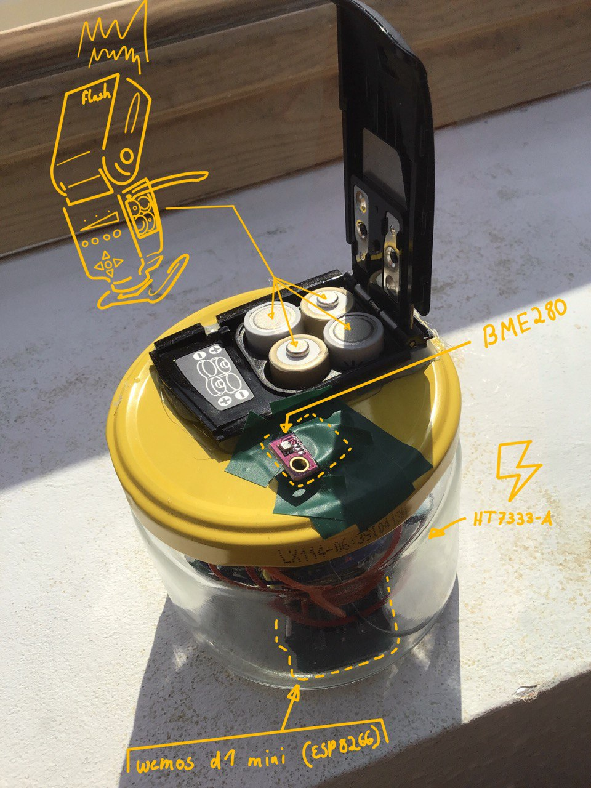
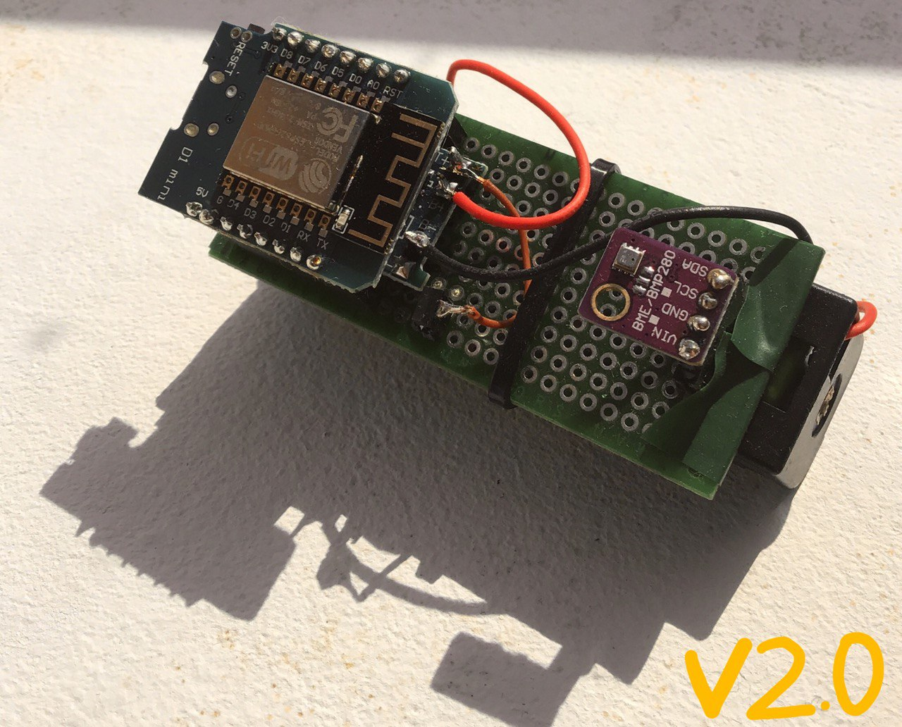
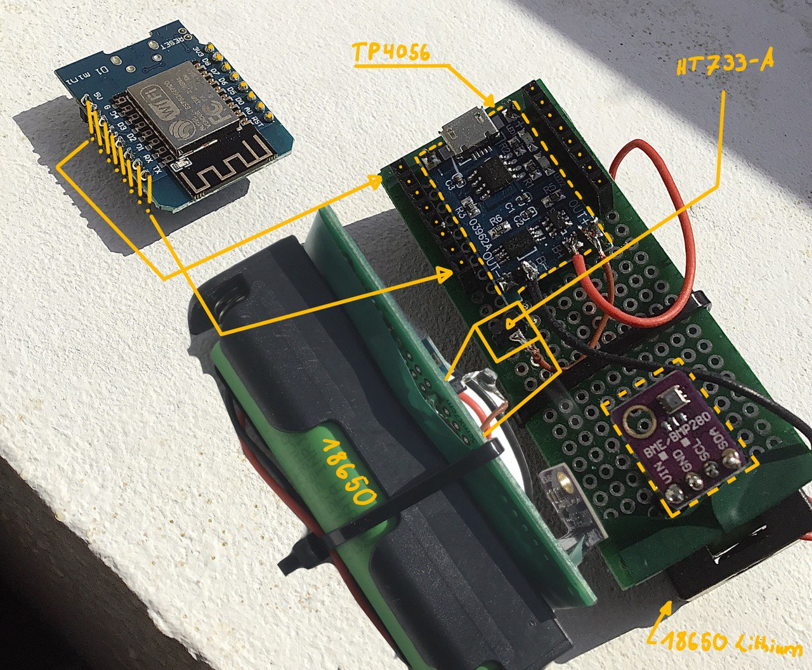

# BME280_telegram
BME280 + wemos_d1 + deepsleep + telegram message

## Version 01

Ist aus einem kaputte Aufsteckblitz und Dipglass entstanden. Es gibt in den Glass eine Steckleiste 3,3 V und Steckleiste Ground weil es nur Dummy ist.

> Es gibt keinen Tiefenentladungsschutz.

### Aufbau

---

## Version 02

Bei der Hülle muss ich mal schauen was es so für Verpackungsmüll gibt den man dafür benutzen kann.

### Aufbau

Wemos D1 mini und der BME280 haben eine Steckverbindungen bekommen damit sie ohne Schaden eventuell in ein anderes Projekt transplantiert werden können.

> Durch den TP4056 kann man jetzt die Akkus laden direkt und sie können sich nicht Tiefenentladen. 

